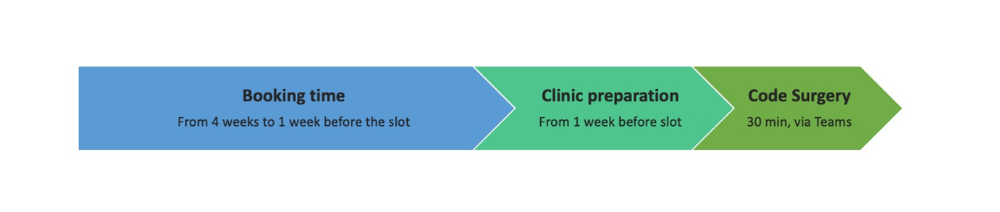

# Code Surgeries

Code Surgeries are **30 min slots available every two weeks** when the RSE Team can discuss with you about issues of your software and provide advice on topics like:

- Software development best practices
  - version control
  - testing
  - code architecture
  - continuous integration
- Code review
- Code optimisation
- Software packaging, distribution, and publication

Contrary to the existing HPC Clinics, meant to provide immediate support in relation to the HPC and the RDS, **Code Surgeries purpose is to provide long-term impact for custom code bases**. For that reason, slots are booked, and the information related to the request (eg. link to software repository) sent **a minimum of 1 week in advance**, so the RSE team can review the material, prepare an appropriate response, and compile the resources that researchers can then use themselves to improve their software.

The timeline to book a Code Surgeries appointment is summarised in the following chart:

As slots are limited, please, book only one slot at a time to give everyone the opportunity to benefit from this service.

You can book your appointment in the following link: [RSE Code Surgeries](https://outlook.office365.com/owa/calendar/ResearchComputingService1@ImperialLondon.onmicrosoft.com/bookings/s/51XGnEigiUKEAEBFBL_NRg2)
