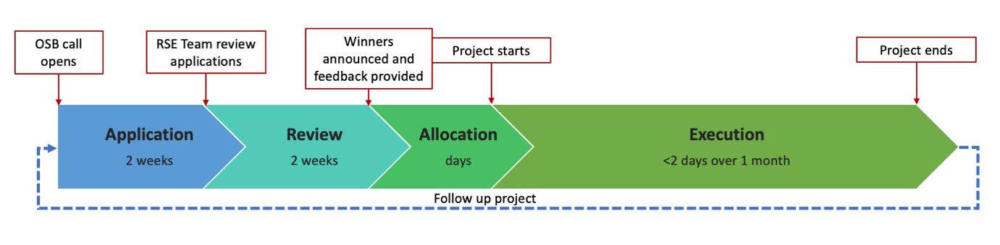

# Open-source booster 

Open-source boosters (OSB) are free, short (<2 days) collaborations to maximise the impact of open-source software developed at Imperial.  

We offer a collection of set activities that we can carry during the allocated time and that tackle one or another aspect of research software, from deployment to citability. When applying for the OSB (see below), you will need to select only one of these options, but nothing prevents you from applying to different options in subsequent editions of the programme. 

To access this programme, **the software must be open source already or be made open source as part of the activities carried out during its execution**. We also require for the RSE Team to be acknowledged in the software repository and in any immediate publication about the software. 

Projects applying to this programme, regardless of them being successful or not, will be included in the [Imperial Research Software Directory](https://imperialcollegelondon.github.io/research-software-directory/) to increase their findability and impact. 

## How to apply 

To apply to an OSB call, you will need to complete a short application form to justify the need for the collaboration and why it cannot be sorted out via other means (eg. Code Surgeries, standard software projects, third-party schemes).  

The team will strive to review the applications for the call, announce the winners and provide feedback within 2 weeks of the closing date. After that, the team will work with you to arrange an appropriate timing to work on the project that, once allocated, will be completed within 1 month. 

The following diagram offers a better idea of the timeline for the OSB programme, with each call lasting around 2 months from its opening to the completion of the execution of the projects. 

We aim to open a call every 2 months, but this might suffer from minor changes due to summer or Christmas holidays, for example. The exact number of slots we offer will be stated at the time of opening the call, but typically they will be 2 or 3 per call. More information for each call will be provided via the [Imperial RS Slack Workspace](https://join.slack.com/t/imperialsrscommunity/shared_invite/zt-e6e02hwh-ex8tqtlzVUL~CltktSQPnw), and the [Imperial RS Community Newsletter](https://imperialcollegelondon.github.io/rs-community-newsletters/). 

## Next call

- **Application period**: 1st-15th September 2022
- **Announcement of successful projects**: 25th September 2022
- **Project delivery period**: October 2022

**Application will open on the 1st September 2022**

Keep an eye on this space, the [Imperial RS Slack Workspace](https://join.slack.com/t/imperialsrscommunity/shared_invite/zt-e6e02hwh-ex8tqtlzVUL~CltktSQPnw), and the [Imperial RS Community Newsletter](https://imperialcollegelondon.github.io/rs-community-newsletters/) for the latest updates on the next OSB call. 

## Options for the OSB programme 

The following list shows the range of activities that the RSE Team can do for your software within this programme. You will need to select just one of them during the application process. You are most welcome to discuss with us beforehand which option is most appropriate for your software and goals via a Code Surgery or via Slack (best effort basis).  

In all cases, appropriate training and knowledge transfer to the researchers is included, so they can take over the maintenance and further development of the project themselves once the collaboration is completed.  

Mind that some of the options scale with the complexity of the software and therefore the OSB programme might not be enough to complete the tasks in the time available. This is one of the selection criteria described bove considered when selecting the projects. 

### Option 1: Paper pre-submission assessment:  

This option is designed to support the publication of research papers that present results obtained with the software, validating those results, facilitating citing the software in the paper and using it by potential reviewers or readers. It involves: 

- Assess the software-related claims made in a research paper     
- Check the reproducibility of the results presented (produced by the software)     
- Ensure installation and usage instructions are correct and clear. Some minor updates of the installation procedure might be done here if deemed necessary, but the purpose of this task is not to refactor the installation process. See the “Software deployment” task for that. 
- Archive the software with a DOI (with Zenodo). Note that the repository will be made open source at this stage if not open already, using a BSD-3 license unless agreed otherwise. See the section about Legal Information.  
- Add instructions about how to cite the software correctly 

### Option 2: Software deployment: 

This option focusses on ensuring the software is easy to deploy in the appropriate platform, typically other researchers’ computers. This deployment process might range from straight forward to really complicated depending on the nature and number of dependencies of the software. For the most complex cases, a standard Software Project might be required. The specific activities to de done depend on the programming language(s) of the software: 

- Setup a versioning system.
- Setup an automated building and deployment system, normally via GitHub Actions or similar.
- Deploy package to PyPI (Python only) in source and wheel form (when possible). 
- Deploy package to conda-forge (Python, C++ and Fortran).
- Ensure installation instructions are correct and clear. 

### Option 3: Documentation infrastructure: 

This option puts in place the infrastructure to build and deploy the documentation for the software using [Read the Docs](https://readthedocs.org/) or [GitHub Pages](https://pages.github.com/), to be agreed at the start of the project. Underlying documentation tools that could be setup, depending on the programming language and complexity, include: 

- Sphinx 
- MKDocs
- Pdoc 
- Doxygen 

Most of this task focuses on training the researchers on how to populate the documentation with the relevant information. 

## Selection criteria 

The following aspects of the software will be evaluated by the members of the RSE Team to select the awarded projects on each round. Aggregated feedback will be provided for each selection criteria as well as recommendations for future steps. 

- The RSE Team has the appropriate expertise to tackle the project 
- The task is doable in the time available 
- The OSB programme is the best route to improve this software
- The value and impact of the software is well justified 
- The software has not benefited yet from the OSB programme
